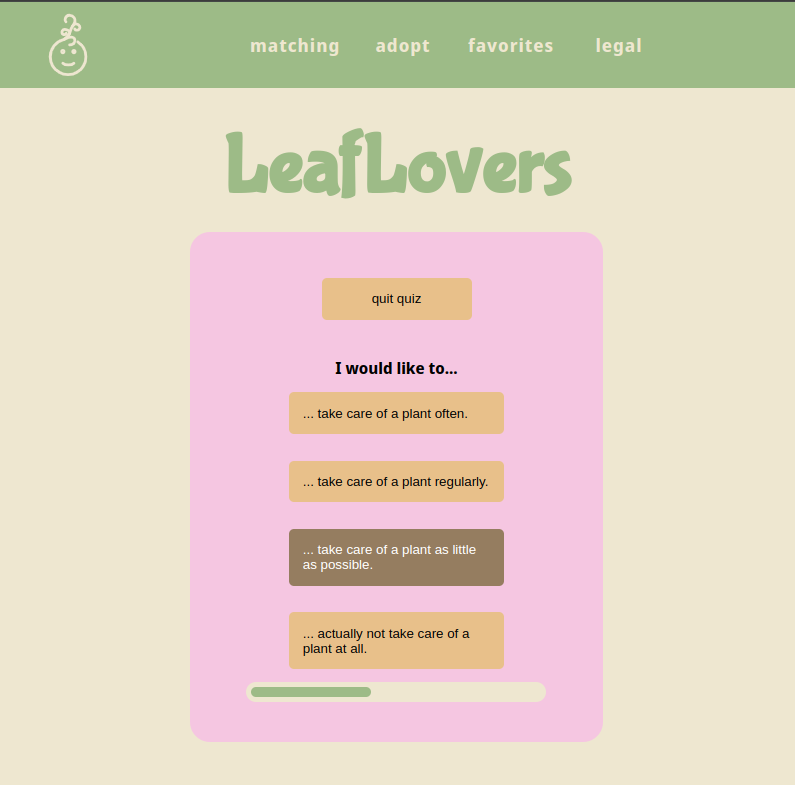

# LeafLovers

<!-- Welcome to LeafLovers! LeafLovers helps you discover the perfect plant match for your lifestyle and preferences. Beyond just matching, it offers a plant exchange platform where you can find and adopt plants from users all over Europe. This web app was crafted by two web development students using React, over a span of seven working days.

 -->

    
    
Welcome to LeafLovers! LeafLovers helps you discover the perfect plant match for your lifestyle and preferences. Beyond just matching, it offers a plant exchange platform where you can find and adopt plants from users all over Europe. This web app was crafted by two web development students using React, over a span of seven working days.

LeafLovers is live and ready for you to explore at: [https://leaflovers.example.com](https://leaflovers.onrender.com)

## Features

### Find your perfect plant

- **Take the Quiz**: Answer a few fun questions about your living conditions and care preferences.
- **Get Recommendations**: Receive tailored suggestions for plants that fit your needs, whether you prefer low-maintenance or love tending to your green friends.
- **Detailed Listings**: Each plant profile includes information on water and light requirements, toxicity, and edibility.

### Adopt plants across Europe

- **Search and Discover**: Look for plants available for adoption from other plant enthusiasts across Europe.
- **Filter Your Search**: Use filters to sort by water needs, light requirements, and city.
- **Save Favorites**: While you are still undecided, save your favorite plants to a personalized list.
- **Adopt a Plant**: Find a plant you love and get in touch with the current owner to arrange the adoption.

## Technical Details

- **Frontend**: Built with [React](https://reactjs.org/) and [Vite](https://vitejs.dev/).
- **Libraries**: Utilizes [React Router](https://github.com/ReactTraining/react-router) and [js-cookie](https://github.com/js-cookie/js-cookie).
- **Styling**: Styled using native CSS with [CSS Modules](https://github.com/css-modules/css-modules).
- **Data Generation**: All plant names and properties are fictional, generated with [Mockaroo](https://www.mockaroo.com/).
- **Image Sourcing**: Plant photos are sourced from the [Pixabay API](https://pixabay.com/api/docs/).

## Screenshots

## Contributors

- **luisePkt**: [GitHub Profile](https://github.com/luisePkt)
- **hannahnier**: [GitHub Profile](https://github.com/hannahnier)

We hope you enjoy using LeafLovers as much as we enjoyed building it!
